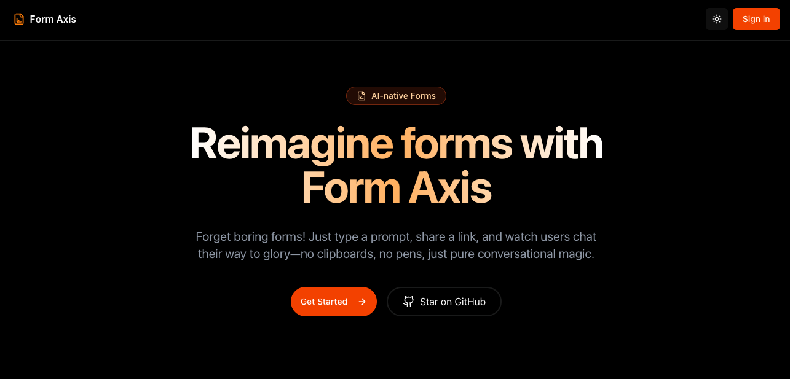

# Form Axis

<p align="center">
  <a href="https://formaxis.vercel.app">
    
  </a>
</p>

<h3 align="center">
<a href="https://formaxis.vercel.app" target="_blank">Form Axis</a>
</h3>

<p align="center">
AI-native Forms that are purely conversational. You set up the form or survey by just writing down a bunch of prompts. It gives you a link you can share for people to “fill out the form.” But it’s just a chat UI.
</p>

## Video Demo

_Click the image below to watch a YouTube demo of Form Axis in action:_

[](https://www.youtube.com/watch?v=Dm7sM2BG-Rw)

## Stack

- Next.js app router
- Tailwind / Shadcn for styling
- Convex for the backend and database
- Clerk for authentication
- Gemini for the LLM
- Vercel's AI SDK as the LLM framework
- Vercel for hosting

## How it works

1. Create account on the site with Clerk
2. Create a new form giving prompt and relevant context
3. Customize form by adding / editing questions and questions type if you need
4. Publish and share the form link
5. People fill out the form by chatting with the AI in chatgpt like ui and the response will get saved in the database
6. You can see the responses in the dashboard along side other analytics

## Cloning & running

1. Clone the repo

```bash
git clone https://github.com/adarshaacharya/form-axis.git
cd form-axis
```

2. Install dependencies

```bash
pnpm install
```

3. Set up environment variables

- Create a `.env` file in the root directory and copy the contents of `.env.example` into it. Make sure you have convex, clerk credentials set up properly.

Please refer to the [Convex with clerk](https://docs.convex.dev/auth/clerk) and [Clerk with convex](https://clerk.com/docs/integrations/databases/convex) documentation for setting up your credentials.

4. First run convex dev server

```bash
npx convex dev
```

Access convex dashboard at : [http://127.0.0.1:6790/?d=anonymous-form-pilot](http://127.0.0.1:6790/?d=anonymous-form-pilot)

5. In another terminal, run the Next.js development server

```bash
pnpm dev
```

## Other commands:

Migrations:

```bash
npx convex run migrations:runIt
```

## Contributing

Contributions are welcome! If you have suggestions for improvements or new features, please open an issue or submit a pull request.

## License

This project is licensed under the MIT License. See the [LICENSE](LICENSE) file for details.

## Sponsorship

If you find Form Axis valuable and would like to support its continued development, please consider:

- Sponsoring project
- Reaching out for consulting or custom implementation at <a href="mailto:hi@adarsha.dev">hi@adarsha.dev</a>
- Sharing Form Axis with your network

Your support helps maintain this project and develop new features!

Built with ❤️ by <a href="https://adarsha.dev" target="_blank">Adarsha Acharya</a>
